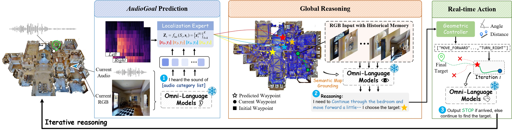

<div align="center">
<h2>
  [NeurIPS 2026] RAO-Nav: Probing Omni-Language Models for Zero-shot Semantic Audio-Visual Navigation
</h2>
</div>

<p align="center">
  <a href="https://arxiv.org/abs/2609.32224">
    
  </a>
  <a href="https://github.com/bjzgcai">
    
  </a>
</p>


## 📖 Overview
We explore whether Omni-Language Models (OLMs) can be directly applied to zero-shot Semantic Audio-Visual Navigation (SAVN). In this paper, we
introduce RAO-Nav, short for Reasoning All-in-One OLM, a deployment pipeline for zero-shot SAVN. By leveraging the rich implicit audio-visual knowledge encoded in OLMs, the embodied agent is enabled to “hear”, “see”, “reason”, and “act” in the environment. To further elicit the built-in thinking ability of OLMs, we propose a test-time Latent Navigation Reasoning (LNR) module that can be seamlessly integrated into the decoding space.

<a href="assets/framework.pdf">
  
</a>


## 📦 Installation

Follow the [installation guide](INSTALLATION.md) to set up the environment and prepare data.

## Localization Expert checkpoint

Download the [checkpoint](https://drive.google.com/drive/folders/1t01cMS0E_aHBKxfWHRsRpKqAtfuwN2fm?usp=sharing) and place it in the `weights` folder.

## Path configuration

`rao_nav_inference/paths.py` derives its defaults from environment variables. Set these variables before running inference:

```bash
export SOUND_SPACES_ROOT=/absolute/path/to/sound-spaces
export AVN_DATA_ROOT="$SOUND_SPACES_ROOT/data"
export RAO_NAV_LOCALIZATION_CKPT="$SOUND_SPACES_ROOT/OmniAV_Nav/weights/localization_expert_qwen_best.pt"
export QWEN_MODEL_DIR="$SOUND_SPACES_ROOT/data/models/Qwen2.5-Omni-7B"
export QWEN_OMNI_URL=http://127.0.0.1:6006/v1/omni/inference
```

Users who prefer fixed paths may edit only the default values in `rao_nav_inference/paths.py`. Environment variables take precedence and are recommended for reproducible deployments.

## 🚀 Inference

Run the Qwen server and the SoundSpaces evaluation in two terminals.

Terminal 1, Qwen2.5-Omni environment:

```bash
conda activate rao-qwen
cd ./OmniAV_Nav
QWEN_MODEL_DIR=./Qwen2.5-Omni-7B \
QWEN_CUDA_VISIBLE_DEVICES=0 \
./scripts/start_qwen_server.sh
```

Terminal 2, SoundSpaces environment:

```bash
conda activate ss
cd ./OmniAV_Nav
SOUND_SPACES_ROOT=./sound-spaces \
AVN_DATA_ROOT=./sound-spaces/data \
NAV_CUDA_VISIBLE_DEVICES=1 \
NAV_PYTHON="$(which python)" \
./scripts/run_test.sh
```

## 🙏 Acknowledgement

This project builds on [SoundSpaces](https://github.com/facebookresearch/sound-spaces), Habitat-Lab, Habitat-Sim, SAVi, and [Qwen2.5-Omni](https://github.com/QwenLM/Qwen2.5-Omni).

## 📄 Citation

If you find our work useful in your research, please cite our paper:

```
@misc{ye2026raonavprobingomnilanguagemodels,
      title={RAO-Nav: Probing Omni-Language Models for Zero-shot Semantic Audio-Visual Navigation}, 
      author={Qilang Ye and Meng Liu and Yu Zhou},
      year={2026},
      eprint={2609.32224},
      archivePrefix={arXiv},
      primaryClass={cs.AI},
      url={https://arxiv.org/abs/2609.32224}, 
}
```
